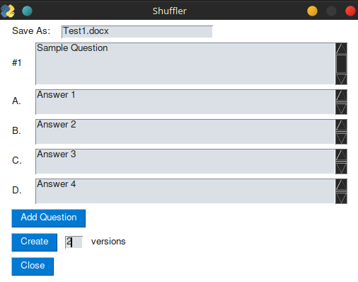

# quiz-creator
<h2>Create quizzes with Python</h2>
A tool for creating and randomizing tests for use in my classroom.
Enter questions and answers, select the number of versions, and generate doc files for each.
A work in progress, but on pause for now.
 

